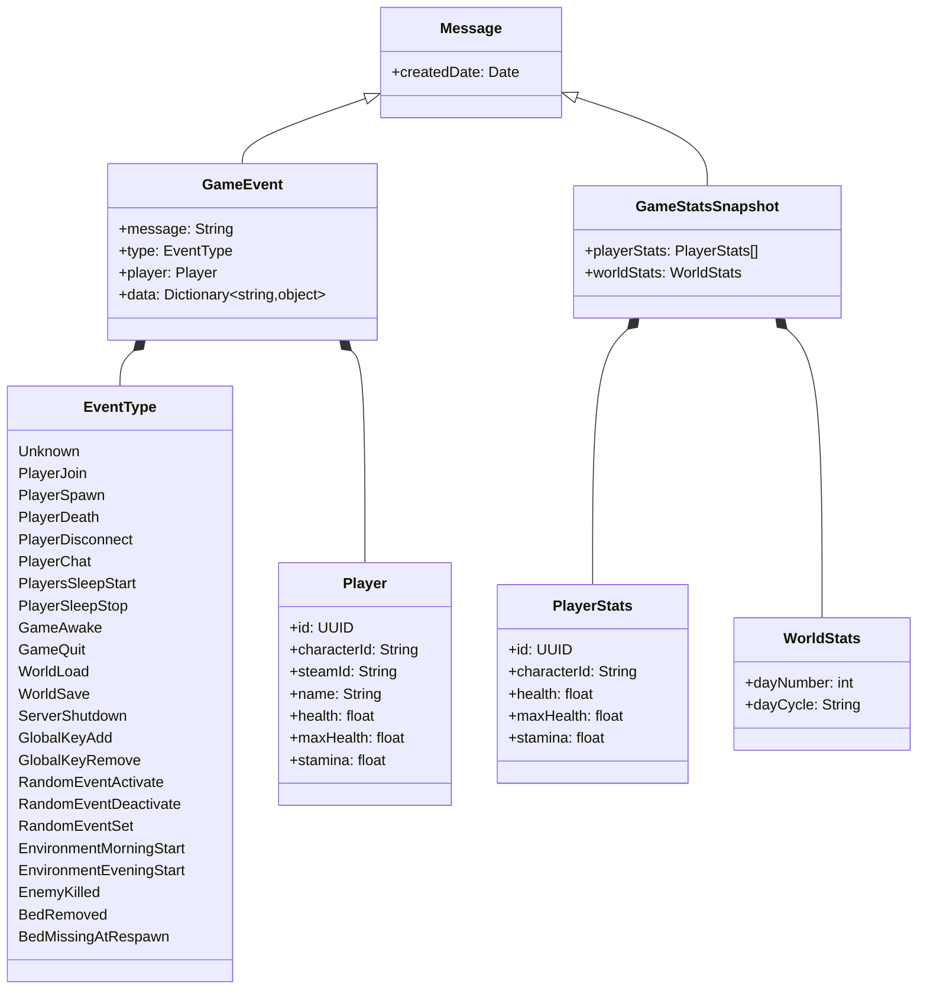

# Event types

Events are categorized into two different types:

- General game events
- Recurrent events

### General game events

These types of events signify actions or changes within the game world. They can be triggered by players' actions or by the game instance itself. Some examples:
- Player joining a server
- Player going to sleep
- The start of the evening
- A non-player creature dying, credited to a connected player
- A claimed bed removed with the hammer (reported by an installed OdinEye.Client)

Use cases for consuming game events include storing and browsing events, as well as executing custom logic when a specific event occurs, such as posting information to a Discord channel.

### Recurrent events

Recurrent events are snapshots of game statistics taken at regular intervals (defaulting to one second). These events include data regarding the current online players and various properties of the game world.  
Use cases for consuming recurrent events include user interfaces that continuously update to display current player health and stamina values.

## Field naming: WebSocket vs. `GET /events`

Both delivery mechanisms carry the same events, but their field casing differs:

- The **WebSocket** stream serializes the `GameEvent` protobuf message directly -- its fields are `message`, `type`, `player`, `data` (as shown in the diagram below).
- **`GET /events`** wraps each event in its own JSON shape with **PascalCase** fields: `Seq`, `Ts`, `Type`, `Message`, `Player` (`Id`/`Name`/`SteamId`), `Data`. `Seq` and `Ts` only exist on the REST feed -- the WebSocket has no sequence number, since it never replays anything.

Every REST API JSON body in OdinEye (not just this feed) uses PascalCase, matching the underlying C# model's own property names exactly -- see the [API Reference](../api-reference/intro.mdx).

## Structured event data

A `GameEvent`'s `Data`/`data` dictionary carries type-specific details. As of this fork:

| Event type | `Data` fields |
|---|---|
| `EnemyKilled` | `Enemy` (prefab name), `Level` (1 = normal, 2 = one star, 3 = two star), `Boss` (bool), `Attackers` (list of player names credited with the kill) |
| `BedRemoved` | `OwnerPlayerId`, `RemoverPlayerId`, `SpawnX`/`SpawnY`/`SpawnZ` -- reported by the *remover's* OdinEye.Client when a claimed bed is taken apart with the hammer |
| `BedMissingAtRespawn` | `LostSpawnX`/`LostSpawnY`/`LostSpawnZ` -- reported by the *victim's* OdinEye.Client when the game clears their custom spawn point because no bed was found there |

Every other event type currently carries no structured `Data`.

## Diagram

